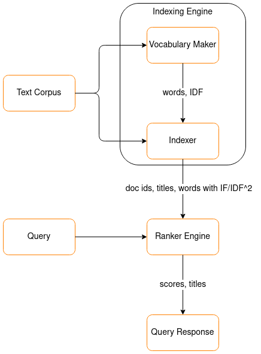
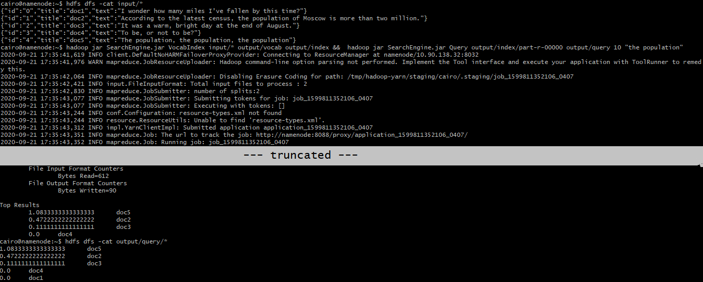
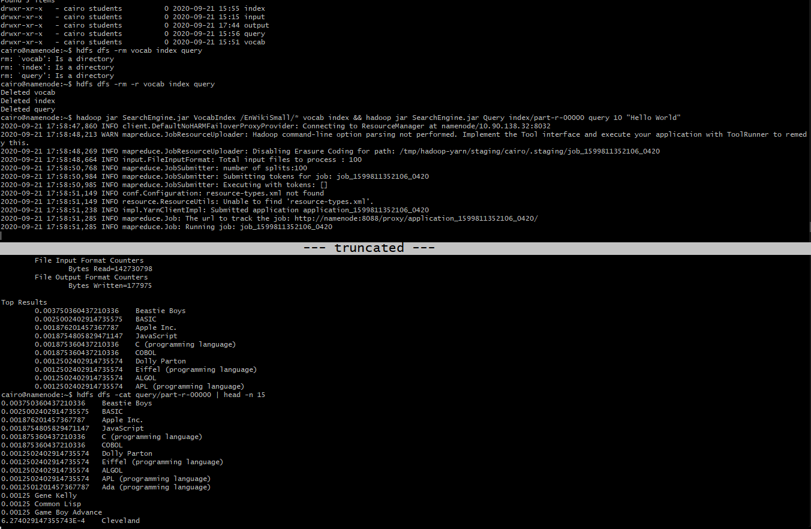
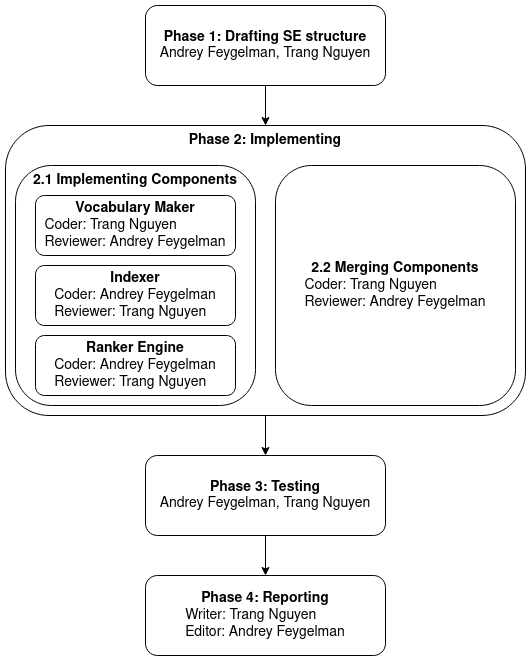

# MapReduce. Simple Text Indexer.

**Team**: cairo

**Members**: [Andrey Feygelman](mailto:a.feygelman@innopolis.university), [Trang Nguyen](mailto:t.nguen@innopolis.university)

**Source code**: [Github](https://github.com/Andrey862/HellAssigment)

This project, which is a part of an undergraduate course - Introduction to Big Data at [Innopolis University](https://innopolis.university/en/), aims to enhance skills of writing Hadoop MapReduce tasks in Java. As a result, a naive Search Engine based on the basic Vector Space Model is implemented completely in Hadoop Mapreduce and runs successfully on the university's Hadoop cluster (Hadoop version 3.3.0). Compiled binary (under the name `SearchEngine.jar`) for this version and source code are published on [Github](https://github.com/Andrey862/HellAssigment).

## Search Engine

To determine the relevance of a document to a query, our Search Engine uses the basic Vector Space Model function `r(q, d) = sum(qi*di)` where `qi`, `di` is TF/IDF weight of i-th term in the query, and document respectively. The basic structure of implementation is presented in the following diagram.



For the sake of this project, [English Wikipedia Dump](https://dumps.wikimedia.org/backup-index.html) is extracted and used as Text Corpus. Each dump file contains multiple JSON strings corresponding to Wikipedia articles with format:

```json
{"id": "0", "url": "https://en.wikipedia.org/wiki?curid=0", "title": "Sample Title", "text": "Sample Text"}
```

### Indexing Engine

- Filename: `VocabIndex.java`
- Usage:
    ```sh
    hadoop jar SearchEngine.jar VocabIndex input_files output_vocab output_index
    ```
- Input: multiple Wikipedia dump files
- Output:
    - Vocabulary: words with their IDF
    - Index: document ids, titles, vectors (words with TF/IDF^2)

Indexing Engine takes multiple files, each file has multiple JSON strings with the previously mentioned format. It includes two jobs running sequentially, i.e. Vocabulary Maker (or Vocab for short) and Indexer (or Index for short).

#### Vocabulary Maker

Vocabulary Maker, which is the first job in Indexing Engine, extracts unique English words from the "text" field of each JSON string in Text Corpus and counts theirs IDF. Since each word itself is unique, there is no need to assign id for it. In Hadoop MapReduce terms, the output key is of Text class, and represents an English word; the output value is of IntWritable class, and represents the number of documents has that word. The result is written to Hadoop file system and latter is used as cache file for Indexer.

#### Indexer

The goal of Indexer is making a file with multiple JSON strings, each represent a document with its id, title and vector of words with TF/IDF^2 instead of TF/IDF:

```json
{"id": "0", "title": "Sample Title", "vector": {"sample": 1.0, "text": 0.5 }}
```

Although this approach leads to a large output file, it latter has two huge advantages for Ranker Engine:
1. Does not need to read the whole Text Corpus again (to extract the title from id).
2. Does not need to read Vocabulary Maker output to get IDF of each word in query since it is already included in TF/IDF^2.

The result is written to the Hadoop file system and later is used as input file for Ranker Engine.

### Ranker Engine

- Filename: `Query.java`
- Usage:
    ```sh
    hadoop jar SearchEngine.jar Query input_index output n query
    ```
- Input: index file (output of Indexing Engine's Indexer)
- Output: scores, titles in descending order; top `n` items printed on console.
- Note: exact 4 arguments are required, query with space should be wrapped

Ranker Engine takes the second output of Indexing Engine, i.e output of Indexer which includes multiple JSON strings representing documents, as input. It will calculate the relevance score of each document with respect to the query string using the basic Vector Space Model function `r(q, d) = sum(qi*di)` where `qi`, `di` is TF/IDF weight of i-th term in the query, and document respectively. The score of each document and its title are written to the Hadoop file system and the top `n` results are printed on `stdout`. In Hadoop MapReduce terms, the output key is of DoubleWritable class, and represents a document's score; the output value is the document's title of Text class.

### Test

The following screenshots show the output of testing the search engine on a sample database with 6 entries and the extracted English Wikipedia dump.





## Contribution

The project was divided in 4 phases and both members actively participated. The following diagram summarizes our contribution.



## References
   - [Assignment №1. MapReduce. Simple Text Indexer](https://hackmd.io/@BigDataInnopolis/HyrkXRQPH#Memory-Consumption)
   - [JSONObject](https://developer.android.com/reference/org/json/JSONObject)
   - [MapReduce Tutorial](https://hadoop.apache.org/docs/current/hadoop-mapreduce-client/hadoop-mapreduce-client-core/MapReduceTutorial.html)
